# iPad3 便携屏 - 3D 打印外壳

将闲置的 iPad3 屏幕改造为一台带外壳的便携显示器。

本仓库提供完整外壳的 **SolidWorks 源文件** 与 **STL 打印文件**，以及详细的组装教程。

---

## 📌 项目简介

iPad3 的屏幕（Retina 显示屏）即使放在今天，依然具备不错的显示素质。搭配驱动板和转接板后，可以变成一台便携式显示器，适用于：

- 树莓派 / 迷你主机外接屏幕
- 备用调试屏
- DIY 便携显示设备

本仓库不包含驱动板和屏幕，仅提供 **外壳的 3D 设计文件** 和 **组装方案**。

---

## 📁 文件说明

| 路径 | 说明 |
|------|------|
| `Source/` | SolidWorks 源文件（.sldprt），可编辑修改 |
| `images/` | 组装教程配图 |

---

## 📦 所需材料

| 类型 | 规格 / 型号 | 数量 |
|------|-------------|------|
| 屏幕 | iPad3 屏幕 | 1 块 |
| 驱动板 | PCB800869（含转接小板） | 1 套 |
| 音响 | 3525 音响 | 2 个 |
| 手机支架 | — | 1 个 |
| M2 螺丝及螺母 | M2 | 9 套 |
| M4 螺母 | M4 | 14 个 |
| M4 螺丝 | M4 | 3 个 |
| 本项目的 3D 打印外壳 | — | 1 套 |

---

## 🛠 所需工具

- 打火机 1 个
- 镊子 1 个

---

## 🔧 组装步骤

### 1. 准备好上壳

取出上壳。

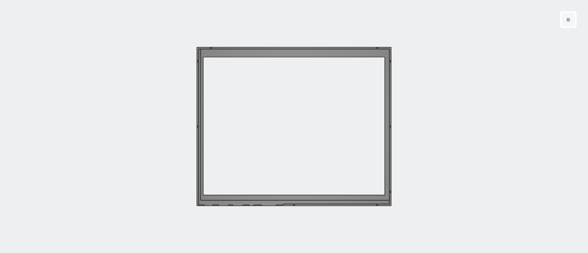

### 2. 处理屏幕

将 iPad3 屏幕边框的 **四个小耳朵剪掉**，然后将屏幕放入上壳框中。

### 3. 安装驱动板与音响

取出底壳。

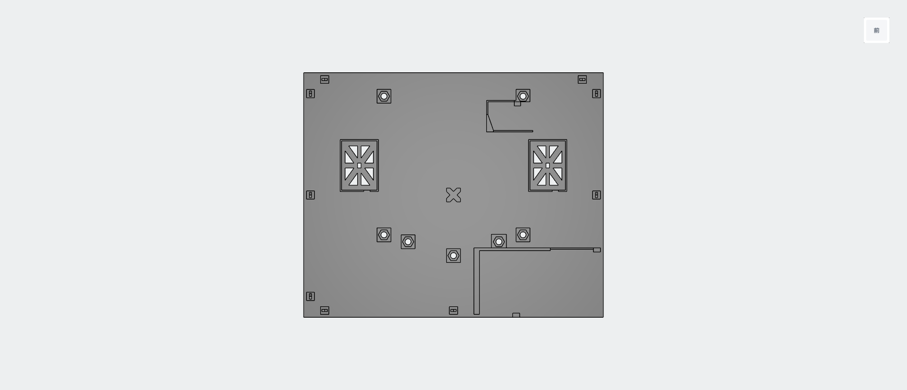

将驱动板和 3525音响安装到底板上：

驱动板如图：

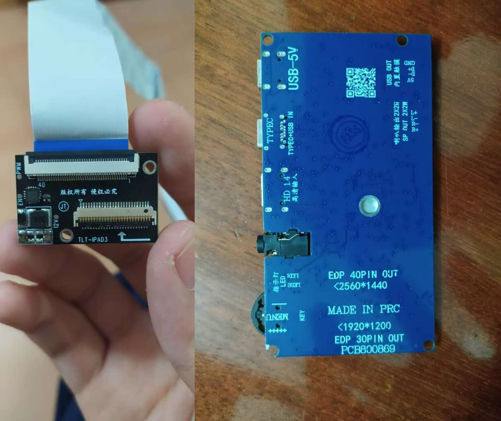

3525音响如图：

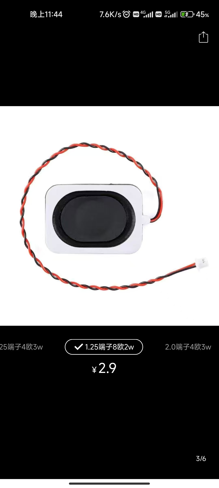

位置参考下图：

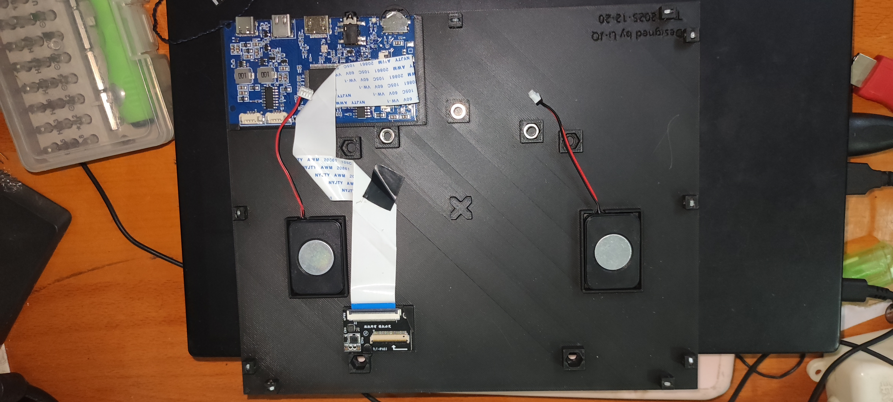

> ⚠️ **注意**：两个音响的线需要 **一长一短**，建议购买线长较长的款式，布线更方便。

### 4. 接线（关键）

按下图线序接入驱动板，**不要接错**。

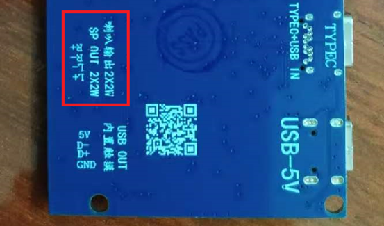

### 5. 预埋 M2 螺母（加热法）

使用打火机、镊子、底壳和 M2 螺母。

**方法**：用镊子夹住 M2 螺母，打火机烘烤约 **10 秒**，然后快速将螺母插入底壳对应孔位中。

目标孔位参考下图：

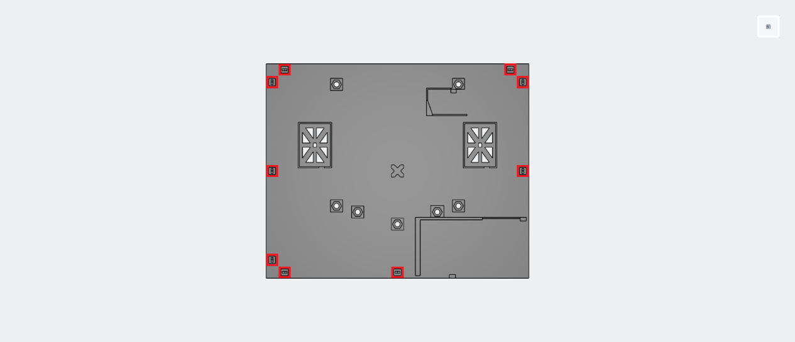

### 6. 预放 M4 螺母

取出 14 个 M4 螺母，如图：

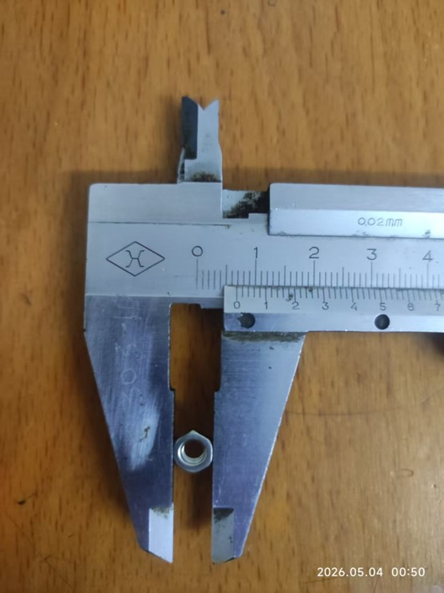

按 **每孔 2 颗** 的方式放入底壳指定孔位中。

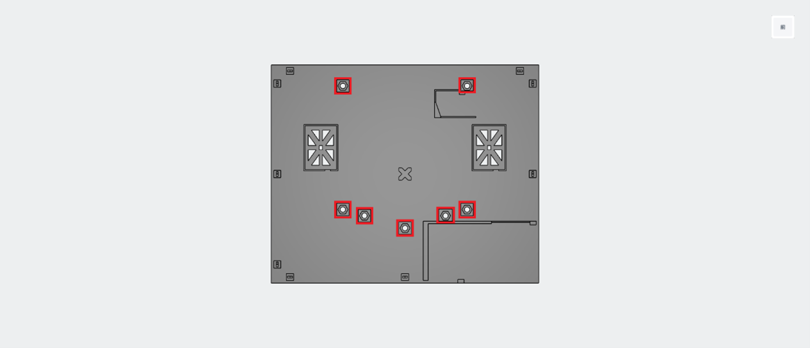

### 7. 扣排线 & 联合测试

扣好 **所有排线**，先不要完全锁死，进行 **通电联合测试**。

### 8. 固定屏幕

确认功能正常后，使用 **M2 螺丝** 将屏幕四周固定。

### 9. 安装支架

使用支架、挡板和 3 个 M4 螺丝（注意：螺丝长度不要超过1.5cm！）

支架如图：

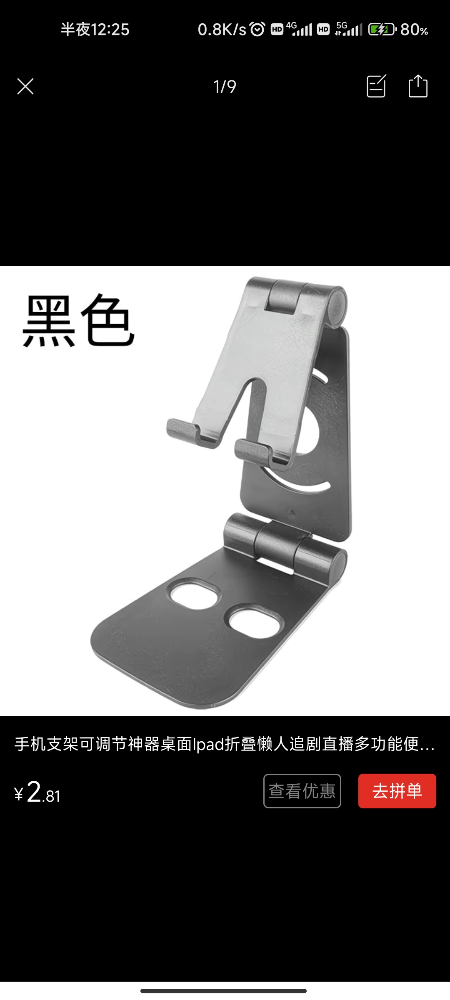

挡板如图：

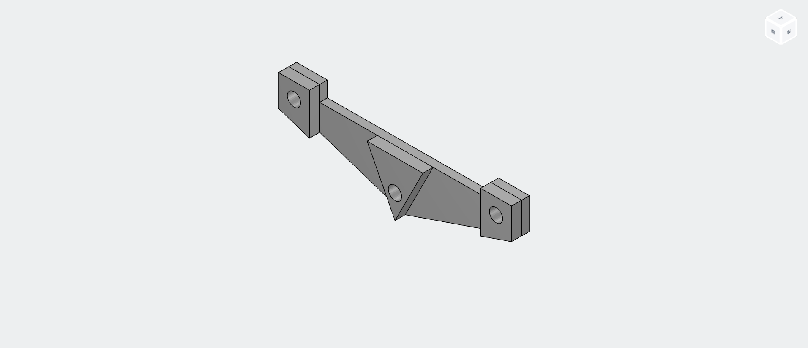

将屏幕整体与手机支架通过挡板夹紧，用 M4 螺丝固定。

**成品效果**：

---

## ✅ 完成

至此，基于 iPad3 屏幕的便携屏制作完成。

---

## ❓ 常见问题

### Q：屏幕不亮 / 背光不亮怎么办？

- 检查排线是否完全插入，尝试重新插拔
- 确认驱动板供电正常（建议使用 5V/2A 以上电源）
- 确认屏幕与驱动板型号匹配

### Q：螺丝拧不进去？

可能是孔内有支撑残留，用小刀或钻头清理后再试。

### Q：音响没有声音？

- 检查音响线序是否接对
- 确认音频信号源已正确输出
- 尝试更换音响测试

### Q：一播放音频就黑屏？
- 使用调整屏幕的音量设置，屏幕内音量我推荐20%以内。
- 对于这个问题，我怀疑是我买的音响电阻太大。

---

**最后更新**：2026年5月10日
